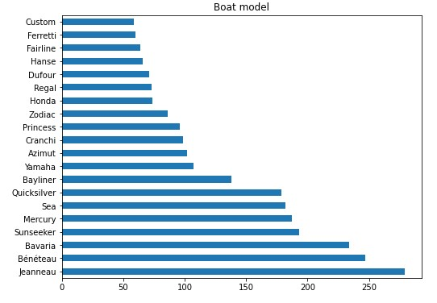
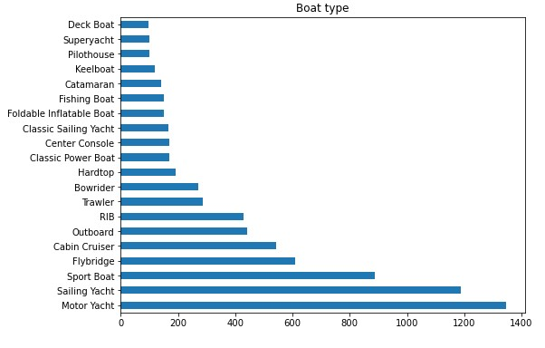
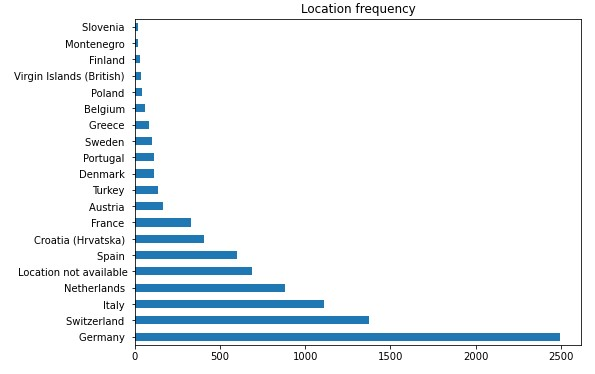
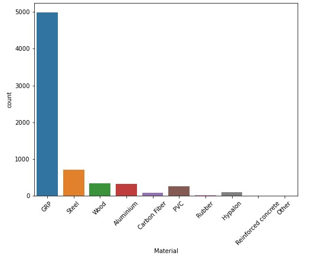
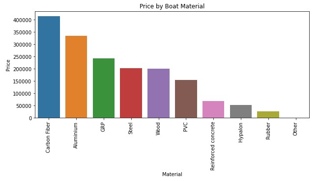
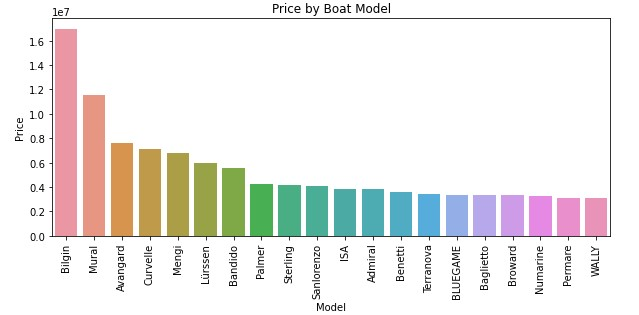
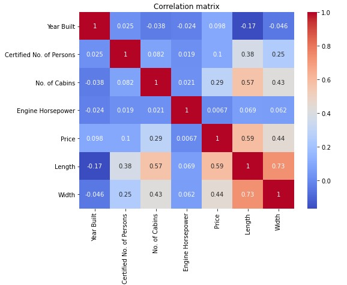
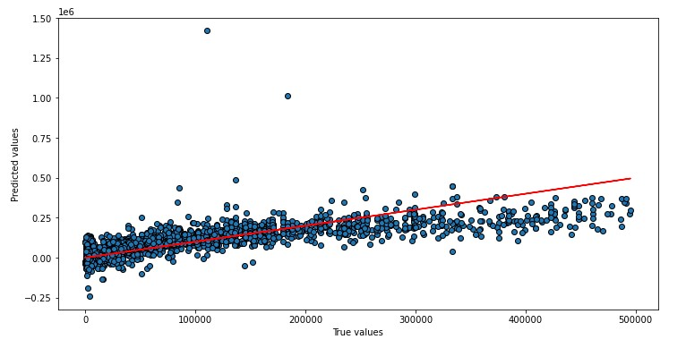

# Boat Price Prediction

## Business problem
The goal of the project was to scrape, mine and analyse information about various boats available for sale online. Using this information we could determine the most popular boat features, boat models and boat type. Finally, looking at it from the customers perspective, the goal was to look at the prices ranges for various boats and try to make a regression model which could predict the boat price from these features.

## Data source
This is a standalone dataset collected by scraping the [boat24.com](https://www.boat24.com/uk/secondhandboats/?occ=1979) website using Scrapy. The code for the web scraper is avaliable [here](https://github.com/teolj96/Boats_Project_repo/blob/main/boats.py), as well as the original csv [file](https://github.com/teolj96/Boats_Project_repo/blob/main/boats_final_2.csv) of the data.

## Data description
The original data contains the following columns:
* **Year Built** - The year in which the boat was built
* **Condition** - The condition of the boat at the time of sale
* **Length x Width** - Both the length and the width of the boat in meters. This was later transformed into two seperate columns
* **Material** - The material which the boat is made of
* **Certified No. of Persons** - The number of persons for which the boat is registered
* **No. of Cabins** - The total number of sleeping cabins in the boat
* **Propulsion** - The propulsion of the boat, not to be confused with the engine
* **Engine** - The engine brand in the boat
* **Engine Performance** - The power of the boat's engine, defined as horsepower
* **Engine Hours** - The number of hours made by the engine, though this columns was dropped due to hue % of null values
* **Model** - The brand of the boat, typically the manifacturer
* **Type** - The boat type, such as a sailing yacht or a motor yacht
* **Location** - The location of the boat the the moment. Originally this column contained the regions and subregions as well but only the countries were used in the final data
* **Price** - The boat's price in british pounds

## Key findings
* Jeanneau is the most popular brand of boats, followed by Beneteau and Bavaria. This makes sense because they are the most popular charter boats in the world and are prefered by companies all over the world

* Motor yachts are the most popular type of boat, followed by sailing boats and sport boats

* Germany is the most popular location for boat brokers, followed by Switzerland and Italy. For the fact that Switzerlands does't have access to the sea, this is very impressive

* Though glass reinforced plastic (GRP) is the most common type of material on a boat, carbon fiber is the most expensive type of boat material

* Bilgin manufactures the most expensive yachts, which is not suprising since they manufacture superyachts. Bilgin is followed by other superyacht manufacturers

* Price is highly correlated with Length and Width, which makes sense because the boat size is the strongest determining factor of the price

## Graphs

Picture 1: Most common boat models

Picture 2: Most common boat type

Picture 3: Location frequency

Picture 4: Most common boat material

Picture 5: Price by boat material

Picture 6: Price by boat manufacturers

Picture 7: Correlation matrix

Picture 8: Linear regression model

## Model performance
I decided to compare a basic linear regression model and neural networks. The main reason I chose linear regression for this is for the simplicity of interpreting the model, which ANNs aren't ideal for. I evaluated the models using MAE and MSE even through MSE but be the better option because of outliers in the data.

In total I ran 3 different ANN models, one basic model, one with an increased number of layers, one with an increased number of neurons and one with stohastic gradient descent as the optimizer.

| Model         | MAE         | MSE         |
| ------------- |-------------|-------------|
| Linear Regression      | 45667.50| 5200817068.73 |
| ANN (Input: 121, Hidden: 121, Output: 1) | 34381.004      |9830265000.0|
| ANN (Input: 121, Hidden: 121, Hidden: 121, Output: 1)   | 34995.54 | 14412964000.0 |
| ANN (Input: 121, Hidden: 242, Output: 1)           | **34628.77**      | **10111264000.0** |
| ANN (Basic model with SGD)                     | 45051.16 | 8585146000.0 |

Overall, ANN model with increased number of neurons performed the best on this data.

## What can be improved
* Dropping more outliers, since the linear regression model performed worse on higher prices
* Using less features in the modelling
* Doing a dimension reduction
* Hyperparameter tuning with grid search

OSVRNI SE NA DATA CLEANING I FEATURE ENGINEERING
